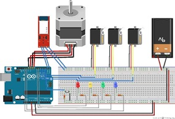
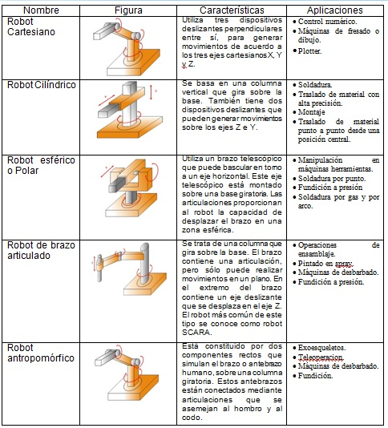
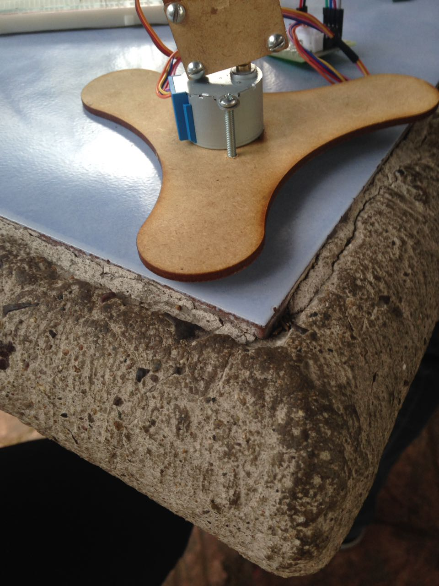
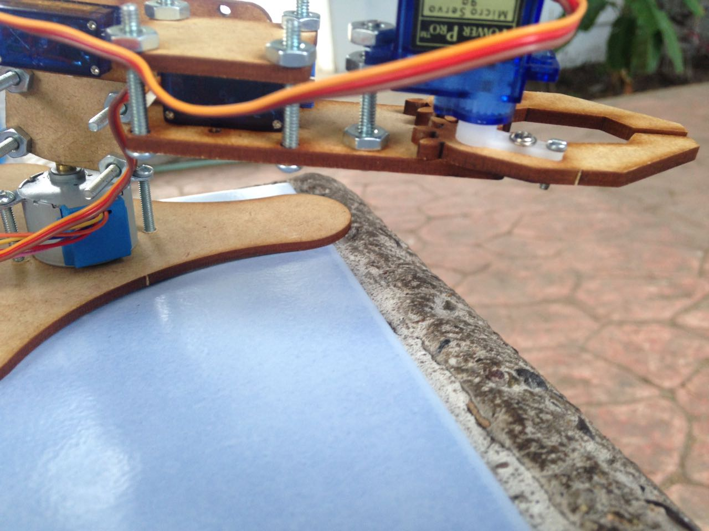
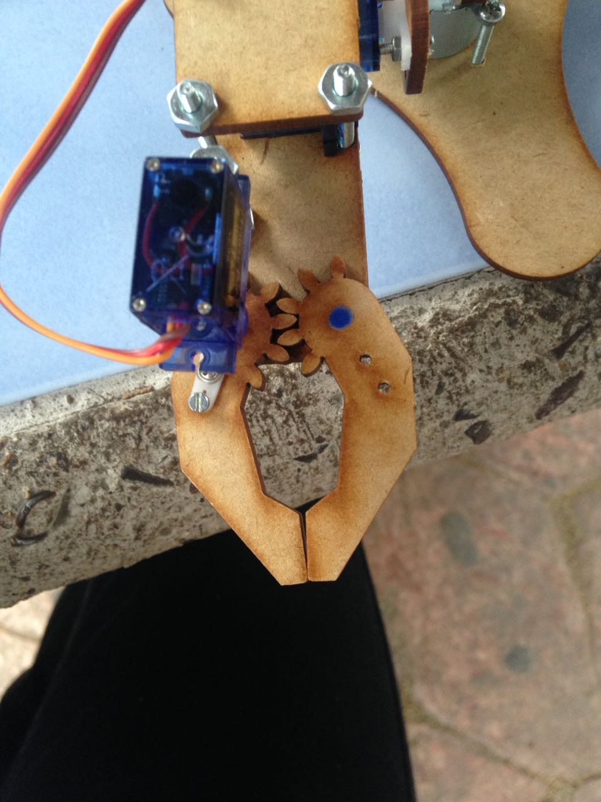
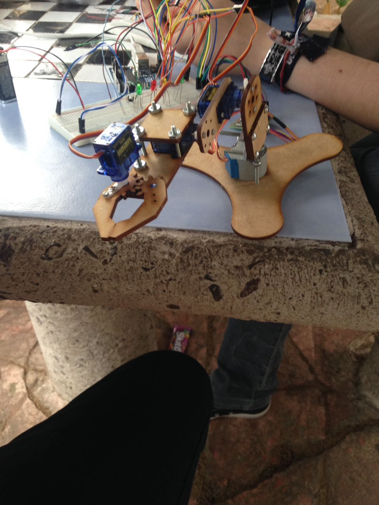

#BRAZO ROBÓTICO DE 4 EJES
***Objetivo***
--------------------------
El propósito de esta práctica es desarrollar paso a paso un proyecto para controlar y programar un Brazo Robot, simulando las funciones básicas de un robot industrial.

###El robot debe tener dos funciones básicas:
---------------------------------------------
- Programar: Registrar las posiciones de los brazos en tres dimensiones (cada registro es un "paso", un programa consiste en una serie de pasos). *Screen de las posiciones

- Ejecutar: Realice en secuencia las posiciones registradas en el "Programa". El robot ejecutará el programa hasta que se use el comando "ABORTAR". *Screen

###Caracteristicas principales:
---------------------------------------------
  .
  .
  - El proyecto se usa para controlar robots con 4 DOF ("Grados de libertad").

  .
  .
  - El robot se debe controlar en modo "REMOTO" (a través de un programa en java por medio del puerto serial).
<pre>
public BrazoRoboticoGUI(){
        try {
            //Se inicia la comunicación con el Puerto Serie
            ino.arduinoTX("COM11", 9600); 
        } catch (ArduinoException ex) {
            Logger.getLogger(BrazoRoboticoGUI.class.getName()).
                    log(Level.SEVERE, null, ex);
        }
        PanelPrincipal = new JPanel();
        setVisible(true);
        panelPrincipal();        
    }
</pre>
  .
  .
  - La información para el usuario se podrá proporcionar a través de LEDS de colores, una pantalla LCD de 2 líneas y/ó sonido (un zumbador).

  .
  .
  - Los brazos robóticos se pueden clasificar de acuerdo con el número de "articulaciones" o "Grados de libertad" (DOF) que tienen.

  .
  .
  -La "Base", o "Cintura", por lo general puede girar el brazo 180o o 360o, dependiendo del tipo de Servo utilizado (aquí en este proyecto, se debe utilizar un motor a pasos para girar 360o)-
<pre>
//---A PASOS---
int retardo = 5;        // Tiempo de retardo en milisegundos (Velocidad del Motor)
int dato_rx;            // Valor recibido en grados
int numero_pasos = 0;   // Valor en grados donde se encuentra el motor

//---A PASOS---    
case 'D':
    delay(retardo);
    digitalWrite(6,LOW);
    digitalWrite(7,LOW);
    digitalWrite(12,LOW);
    digitalWrite(13,HIGH);
    while (dato_rx > numero_pasos){   // Giro hacia la izquierda en grados
        paso_izq();
        numero_pasos = numero_pasos + 1;
    }
    while (dato_rx < numero_pasos){   // Giro hacia la derecha en grados
        paso_der();
        numero_pasos = numero_pasos -1;
    }
    EEPROM.write(contador, cadena);
    contador++;
    break;
void paso_der(){         // Pasos a la derecha
    digitalWrite(11, LOW); 
    digitalWrite(10, LOW);  
    digitalWrite(9, HIGH);  
    digitalWrite(8, HIGH);  
    delay(retardo); 
    digitalWrite(11, LOW); 
    digitalWrite(10, HIGH);  
    digitalWrite(9, HIGH);  
    digitalWrite(8, LOW);  
    delay(retardo); 
    digitalWrite(11, HIGH); 
    digitalWrite(10, HIGH);  
    digitalWrite(9, LOW);  
    digitalWrite(8, LOW);  
    delay(retardo); 
    digitalWrite(11, HIGH); 
    digitalWrite(10, LOW);  
    digitalWrite(9, LOW);  
    digitalWrite(8, HIGH);  
    delay(retardo);  
}

void paso_izq() {        // Pasos a la izquierda
    digitalWrite(11, HIGH); 
    digitalWrite(10, HIGH);  
    digitalWrite(9, LOW);  
    digitalWrite(8, LOW);  
    delay(retardo); 
    digitalWrite(11, LOW); 
    digitalWrite(10, HIGH);  
    digitalWrite(9, HIGH);  
    digitalWrite(8, LOW);  
    delay(retardo); 
    digitalWrite(11, LOW); 
    digitalWrite(10, LOW);  
    digitalWrite(9, HIGH);  
    digitalWrite(8, HIGH);  
    delay(retardo); 
    digitalWrite(11, HIGH); 
    digitalWrite(10, LOW);  
    digitalWrite(9, LOW);  
    digitalWrite(8, HIGH);  
    delay(retardo); 
}
        
void apagado() {         // Apagado del Motor
    digitalWrite(11, LOW); 
    digitalWrite(10, LOW);  
    digitalWrite(9, LOW);  
    digitalWrite(8, LOW);  
}
</pre>

  .
  .
  - El "Hombro" es el responsable de "levantar o bajar" el brazo verticalmente.
<pre>
case 'C':
          val_C = EEPROM.read(i);
          digitalWrite(6,LOW);
          digitalWrite(7,LOW);
          digitalWrite(12,HIGH);
          digitalWrite(13,LOW);
          break;
servo_C.write(val_C);          
</pre>               

  .
  .
  - El "codo" hará que el brazo "avance o retroceda".
<pre>               
case 'B':
          val_B = EEPROM.read(i);
          digitalWrite(6,LOW);
          digitalWrite(7,HIGH);
          digitalWrite(12,LOW);
          digitalWrite(13,LOW);
          break;
servo_B.write(val_B);           
</pre>               

  .
  .
  - La "Garra" o "Pinza" funciona abriendo o cerrándose para "agarrar cosas".
<pre>
case 'A':
          val_A = EEPROM.read(i);
          digitalWrite(6,HIGH);
          digitalWrite(7,LOW);
          digitalWrite(12,LOW);
          digitalWrite(13,LOW);
          break;
servo_A.write(val_A);          
</pre>  

  .
  .
  - Resultado. Brazo robótico 4 DOF.

Proyecto realizado por:
-----------------------
Saucedo Guerrero Daniel de Jesús
14240859@itleon.edu.mx
Instituto Tecnológico de León
